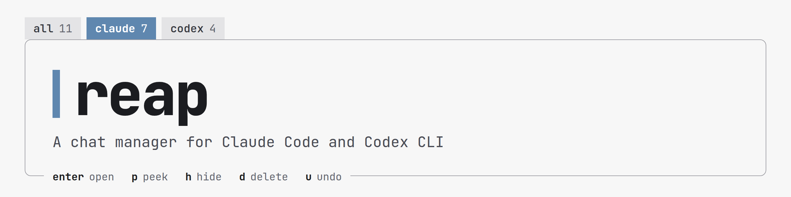
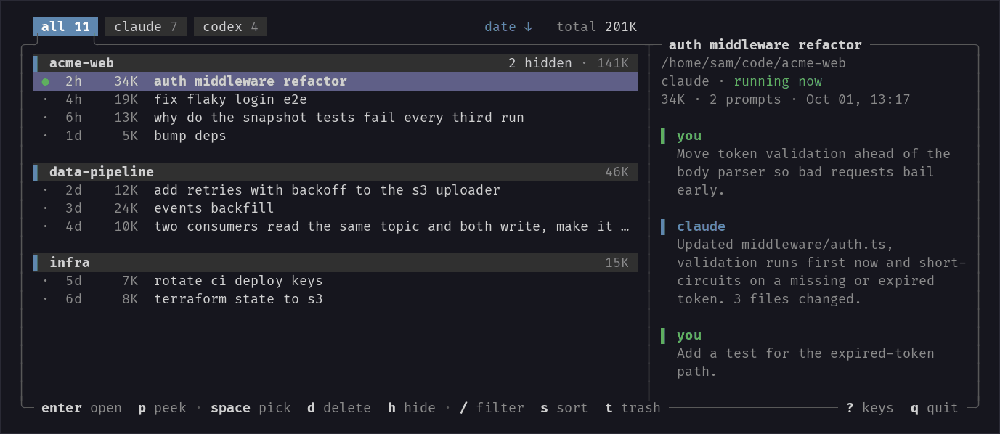
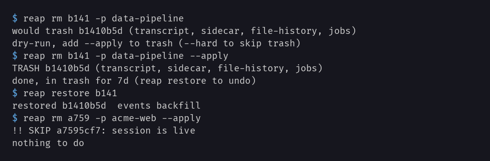

<picture>
  <source media="(prefers-color-scheme: dark)" srcset="docs/banner-dark.png">
  
</picture>

[](https://github.com/vyagh/reap/tags)

List, open and delete Claude Code and Codex CLI chats. Deletes are for real.

Claude Code has no way to delete one chat you choose. ctrl+x in the agents view drops the job record. The transcript stays on disk and the chat is back in `/resume`.

`reap` removes the whole session. Codex CLI chats are listed next to the Claude Code ones. `reap rm` is a dry run until you say `--apply`. The picker asks first. Live sessions are refused, and every delete goes to a trash you can undo from, unless you pass --hard.

Codex has `codex archive` already. reap puts both agents in one list, with the running check and the 7-day undo on top of it.



## Install

```sh
curl -fsSL https://raw.githubusercontent.com/vyagh/reap/v0.5.0/reap -o ~/.local/bin/reap
chmod +x ~/.local/bin/reap
```

One file of stdlib Python, so read it before you run it. Python 3.8 or newer. Linux and macOS, or WSL on Windows. WSL sees only WSL-side installs, so chats made by the Windows-side apps are not visible.

## Use

Coming from 0.4.0: plain `reap` now shows every project and `--all` exits with a message. Enter no longer deletes.

```sh
reap            # every project, cursor on this folder's project
reap .          # this folder only
reap <name>     # one project, by folder name
```

With both agents installed, the tabs `all / claude / codex` switch agent with `tab` and `shift-tab`. Enter opens the chat under the cursor in its own agent and folder, then reap quits. It runs `claude --resume <id>` or `codex resume <id>` directly, so shell aliases for `claude` or `codex` do not apply. In the list, `d` is the only delete key.

| key | does |
|---|---|
| `enter` | open the chat |
| `space` | pick |
| `a` | pick everything shown, again to unpick. Running chats are skipped |
| `d` | delete what you picked, after a confirm |
| `u` | undo what you deleted in this run |
| `p` | read the chat first |
| `h` | hide the chat from the list |
| `.` | show hidden chats, or hide them again |
| `s` | sort: newest, oldest, biggest, smallest |
| `P` | with both agents: make this tab the one reap opens on, again to undo |
| `/` | filter |
| `t` | open the trash |
| `?` | all keys |

The mouse works too: click a tab, a row or a group line, and the wheel scrolls.

Hiding is not deleting. A hidden chat keeps all its files and shows again under `.`. The list of hidden chats and the pinned tab are in `~/.local/state/reap/state.json`.

The same from a script:

```sh
reap ls                 # every chat that is not hidden, grouped by project
reap ls --hidden        # the hidden ones
reap rm 5d4a            # dry run, for a chat of this folder (-p <name> for another)
reap rm 5d4a --apply    # trash it
reap restore 5d4a       # bring it back
reap trash --empty      # purge the trash, no prompt
```

## Safety

One chat from dry run to restore, then a running session that gets refused:



| what | how |
|---|---|
| trash | `~/.claude/.reap-trash/`. Kept 7 days, pruned the next time reap runs |
| undo | `u` in the picker, most recent first. `t` or `reap restore` for anything older |
| trash screen | `space` picks, `r` restores the picks or the row, `x` purges the picks, `E` empties the tab you are on, or just the filtered rows, `/` filters |
| Codex chats | reap does not move Codex's files. It runs `codex archive <id>` and the chat waits in `~/.codex/archived_sessions/`. Restore runs `codex unarchive`. After 7 days the next reap start runs `codex delete --force` on it, no prompt. Restore before then if you want it back |
| `--no-codex-cli` | moves the rollout file into reap's own trash instead of calling `codex`, like a Claude chat. Codex's own record then points at a missing file until you restore |
| no `codex` on PATH | the delete fails with a message and the chat stays where it is. A restore that fails keeps its trash entry so you can retry. A purge still drops the entry and leaves the file in Codex's archive |
| `--hard` | skips the trash. On a Codex id it runs `codex archive` then `codex delete --force`. Still a dry run without `--apply`, still refuses live sessions |
| `rm --orphans` | dry run and trash like `rm`. No live check, orphans have no session. `memory/` is skipped |
| writes to | `~/.claude/projects/`, `jobs/`, `file-history/`, `session-env/`, `tasks/`, its own trash, and `~/.local/state/reap/state.json`. Codex chats only through the `codex` command, unless you pass --no-codex-cli. To tell if a Codex chat is running, reap opens and briefly locks its file in `~/.codex/thread-writer-locks/` |
| never touches | settings, credentials, anything inside a `memory/` folder (an empty one left alone in a project dir goes with that dir after a purge), and the prompt history files `~/.claude/history.jsonl` and `~/.codex/history.jsonl`. reap leaves both alone |

## How it works

A Claude Code chat is several things on disk, and the built-in views reach only two of them. `CLAUDE_CONFIG_DIR` is honoured, so `~/.claude` below means that folder if you set it:

```
~/.claude/
├── projects/<project>/
│   ├── <id>.jsonl          transcript        what /resume reads
│   └── <id>/               sidecar dir       tool results and sub-agent logs
├── jobs/<short-id>/        job record        what the agents view lists
├── file-history/<id>/      edit snapshots    can be large
├── session-env/<id>/       small state
└── tasks/<id>/             small state
```

ctrl+x in the agents view removes only the job record. That's why the chat keeps coming back. `reap` moves all of it to the trash together, and back on restore. Job records that resume this chat go with it.

A Codex chat is one rollout file under `~/.codex/sessions/` (`CODEX_HOME` is honoured). reap lists the chats under `sessions/` and hands the delete to the `codex` command. After a delete it reads the archived copy in `archived_sessions/` for the trash view.

Live means a process still holds the session. For Claude Code, `reap` checks the pid in `~/.claude/sessions/` and the daemon roster. For Codex it looks for a held writer lock in `~/.codex/thread-writer-locks/`. A held lock counts as live, and so does a lock file reap cannot open. No lock file means exited.

| the session | what reap does |
|---|---|
| still running | refused, in the picker and on the CLI |
| exited | can be deleted right away, on the machine that ran it |
| a background job with no process | treats it like any other chat |
| started on another machine or in a container | on Linux, kept protected when the session records its machine. Delete it where it ran |
| on macOS | sessions made there are checked by pid only. One that records a Linux machine stays protected |

| option | does |
|---|---|
| `rm --orphans` | remove sidecar dirs that lost their transcript |
| `rm --orphans --all` | the same across every project |
| `rm -p <name>` | delete in another project. The picker and `ls` take the name directly. `rm` takes Codex ids as well as Claude ones |
| `--tmp` | with plain `reap` or `ls`: also show scratchpad sessions under `/tmp` |

## License

MIT, see [LICENSE](LICENSE).
